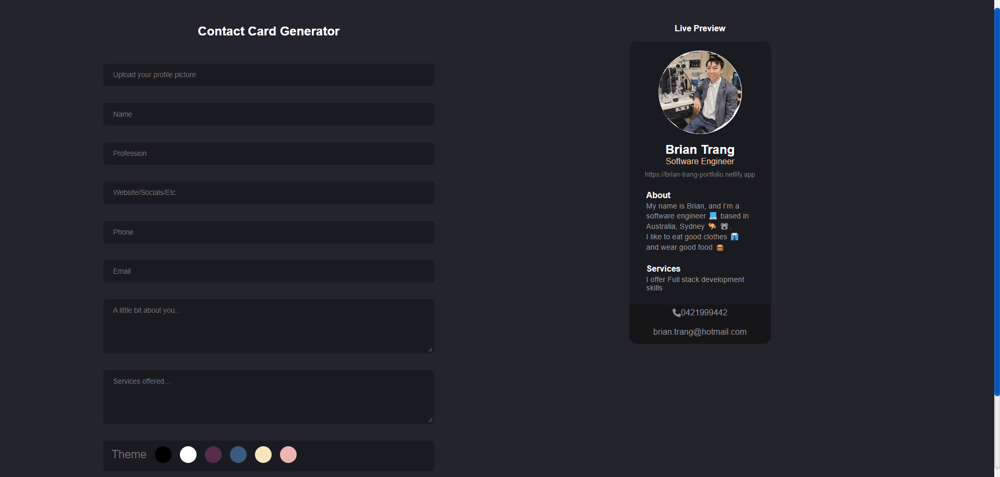

# Business Card Generator 
Simple Business Card Generator with a live preview and option to download the card in png format.
https://business-cards-generator.netlify.app  


[](https://app.netlify.com/sites/brian-trang-portfolio/deploys)

## 📓 Table of Contents
- [Business Card Generator](#business-card-generator)
  - [📓 Table of Contents](#-table-of-contents)
  - [💡🏡 Lighthouse](#-lighthouse)
  - [📄 Description](#-description)
  - [🪛 Technologies used](#-technologies-used)
  - [🖥️Installation](#️installation)
  - [💬Usage](#usage)
  - [🖼️Screenshot](#️screenshot)
  - [📹Video](#video)
  - [⚖️License](#️license)
  - [🤝Contributing](#contributing)
  - [🛠️Tests](#️tests)
  - [❔Questions](#questions)

## 💡🏡 Lighthouse
This is the Lighthouse Google report showcasing Performance 🚀, Accessibility ♿️, Best practices ✅, and SEO 🔍.


## 📄 Description 
Contains About Me, Experience, Skills, Projects, Contact, Resume, Email, Footer  
also contains bad humour!  

 
## 🪛 Technologies used 
| Technology              | Description                           | Link                                       |
|-------------------------|---------------------------------------|--------------------------------------------|
| Node.js                 | Server-side JavaScript runtime         | [Node.js](https://nodejs.org/)             |
| NPM                     | Node.js Package Manager               | [NPM](https://www.npmjs.com/)             |
| Font Awesome            | Icon set and toolkit                  | [Font Awesome](https://fontawesome.com/)   |
| Font Awesome (React)    | Font Awesome for React components     | [Font Awesome (React)](https://fontawesome.com/) |
| EmailJS                 | Email delivery service                 | [EmailJS](https://www.emailjs.com/)       |
| EmailJS (Com)           | Email service for developers          | [EmailJS (Com)](https://www.emailjs.com/) |
| React                   | JavaScript library for building UIs   | [React](https://reactjs.org/)             |
| React DOM               | React rendering for the DOM           |
| react-router-dom          | Declarative routing for React.js       | [react-router-dom](https://reactrouter.com/web/guides/quick-start) |
| react-router-hash-link    | Hash link navigation for React Router  | [react-router-hash-link](https://www.npmjs.com/package/react-router-hash-link) |
| animate.css               | Library for animations                 | [animate.css](https://animate.style/)               |
| react-on-screen           | React component for on-screen events   | [react-on-screen](https://www.npmjs.com/package/react-on-screen) |
| bootstrap                 | Front-end framework                    | [bootstrap](https://getbootstrap.com/)              |
| install                   | Package manager for JavaScript         | [install](https://www.npmjs.com/package/install)    | [React DOM](https://reactjs.org/)         |
| React Icons             | SVG icon library for React            | [React Icons](https://react-icons.github.io/react-icons/) |
| React Simple Typewriter | React component for typewriter effect | [React Simple Typewriter](https://www.npmjs.com/package/react-simple-typewriter) |
| Semantic UI CSS         | Front-end framework                   | [Semantic UI CSS](https://semantic-ui.com/) |
| Semantic UI React       | React integration for Semantic UI      | [Semantic UI React](https://react.semantic-ui.com/) |
| SweetAlert2             | Alert library for JavaScript          | [SweetAlert2](https://sweetalert2.github.io/) |
| Vite (Plugin React)     | Vite plugin for React apps            | [Vite (Plugin React)](https://github.com/vitejs/vite) |
| ESLint                  | JavaScript linter                     | [ESLint](https://eslint.org/)             |
| ESLint (Plugin React)   | ESLint plugin for React               | [ESLint (Plugin React)](https://eslint.org/) |
| ESLint (Plugin React Hooks) | ESLint plugin for React Hooks      | [ESLint (Plugin React Hooks)](https://www.npmjs.com/package/eslint-plugin-react-hooks) |
| ESLint (Plugin React Refresh) | ESLint plugin for React Refresh  | [ESLint (Plugin React Refresh)](https://www.npmjs.com/package/eslint-plugin-react-refresh) |
| Vite                    | Frontend build tool                   | [Vite](https://vitejs.dev/)               |
| Netlify                 | Web hosting and automation platform  | [Netlify](https://www.netlify.com/)       |
    
## 🖥️Installation 

Users can clone the code and run npm install to install the dependencies
```pip
 npm install 
```

Afterwards users can run the command ```npm run build``` which will run the Vite build process which will bundle the React source code
```pip
npm run build
```

Afterwards users can run the command ```npm run dev``` which will executes the vite command, which starts the development server provided by Vite  
and allows users to run the code on their local host
```pip
npm run dev
```
This sequence ensures that your client-side code is built before starting the server.


Otherwise this app requires use of the Vite application to be used as well as the following installations.

Vite
```pip
`npm create vite@latest`
```

EmailJS
```pip
npm i emailjs
```

EmailJS-Com
```pip
npm i emailjs-com
```

React Icons
```pip
npm i react-icons
```

React Simple Typewriter
```pip
npm i react-simple-typewriter
```

Bootstrap
```pip
npm i bootstrap
```

React-boostrap
```pip
npm i react-bootstrap
```

Animate.css
```pip
npm i animate.css
```

React on screen
```pip
npm i react-on-screen
```

ESLint
```pip
npm i eslint
```

ESLint Plugin React
```pip
npm i eslint-plugin-react
```

Netlify CLI
```pip
npm i netlify-cli -g
```

React DOM
```pip
npm i react-dom
```

Package.json dependencies ⚙️
Screenshot of Header


## 💬Usage 

Have a look around!!
Link to deployed application
https://business-cards-generator.netlify.app 


## 🖼️Screenshot
Screenshot of Header


Screenshot of Form


## 📹Video
GIF Showing ```npm run dev``` Homepage, form input and download feature 
as well as Email functionality

  
## ⚖️License 
This project is licensed under MIT
  
## 🤝Contributing 
Brian Trang  
  
## 🛠️Tests
N/A
 
## ❔Questions
If you have any questions about this project, please contact me directly at brian.trang9@gmail.com. Feel free to view more of my projects at https://github.com/MakeRedundant.