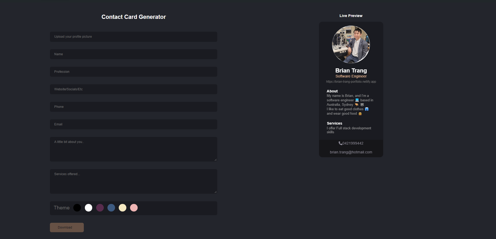

# Business Card Generator 
Simple Business Card Generator with a live preview and option to download the card in png format.  
https://business-cards-generator.netlify.app  


[](https://app.netlify.com/sites/business-cards-generator/deploys)


## 📓 Table of Contents
- [Business Card Generator](#business-card-generator)
  - [📓 Table of Contents](#-table-of-contents)
  - [💡🏡 Lighthouse](#-lighthouse)
  - [📄 Description](#-description)
  - [🪛 Technologies used](#-technologies-used)
  - [🖥️Installation](#️installation)
  - [💬Usage](#usage)
  - [🖼️Screenshot](#️screenshot)
  - [📹Video](#video)
  - [⚖️License](#️license)
  - [🤝Contributing](#contributing)
  - [🛠️Tests](#️tests)
  - [❔Questions](#questions)

## 💡🏡 Lighthouse
This is the Lighthouse Google report showcasing Performance 🚀, Accessibility ♿️, Best practices ✅, and SEO 🔍.


## 📄 Description 
Contains About Me, Experience, Skills, Projects, Contact, Resume, Email, Footer  
also contains bad humour!  

 
## 🪛 Technologies used 
| Technology              | Description                           | Link                                       |
|-------------------------|---------------------------------------|--------------------------------------------|
| Node.js                 | Server-side JavaScript runtime         | [Node.js](https://nodejs.org/)             |
| NPM                     | Node.js Package Manager               | [NPM](https://www.npmjs.com/)             |

| Vite                    | Frontend build tool                   | [Vite](https://vitejs.dev/)               |
| Netlify                 | Web hosting and automation platform  | [Netlify](https://www.netlify.com/)       |
    
## 🖥️Installation 

Users can clone the code and run npm install to install the dependencies
```pip
 npm install 
```

Afterwards users can run the command ```npm run build``` which will run the Vite build process which will bundle the React source code
```pip
npm run build
```

Afterwards users can run the command ```npm run dev``` which will executes the vite command, which starts the development server provided by Vite  
and allows users to run the code on their local host
```pip
npm run dev
```
This sequence ensures that your client-side code is built before starting the server.


Otherwise this app requires use of the Vite application to be used as well as the following installations.

Vite
```pip
`npm create vite@latest`
```

EmailJS
```pip
npm i emailjs
```

EmailJS-Com
```pip
npm i emailjs-com
```

React Icons
```pip
npm i react-icons
```

React Simple Typewriter
```pip
npm i react-simple-typewriter
```

Bootstrap
```pip
npm i bootstrap
```

React-boostrap
```pip
npm i react-bootstrap
```

Animate.css
```pip
npm i animate.css
```

React on screen
```pip
npm i react-on-screen
```

ESLint
```pip
npm i eslint
```

ESLint Plugin React
```pip
npm i eslint-plugin-react
```

Netlify CLI
```pip
npm i netlify-cli -g
```

React DOM
```pip
npm i react-dom
```

Package.json dependencies ⚙️
Screenshot of Header


## 💬Usage 

Have a look around!!
Link to deployed application
https://business-cards-generator.netlify.app 


## 🖼️Screenshot
Screenshot of Header


Screenshot of Form


## 📹Video
GIF Showing ```npm run dev``` Homepage, form input and download feature 
as well as Email functionality

  
## ⚖️License 
This project is licensed under MIT
  
## 🤝Contributing 
Brian Trang  
  
## 🛠️Tests
N/A
 
## ❔Questions
If you have any questions about this project, please contact me directly at brian.trang9@gmail.com. Feel free to view more of my projects at https://github.com/MakeRedundant.